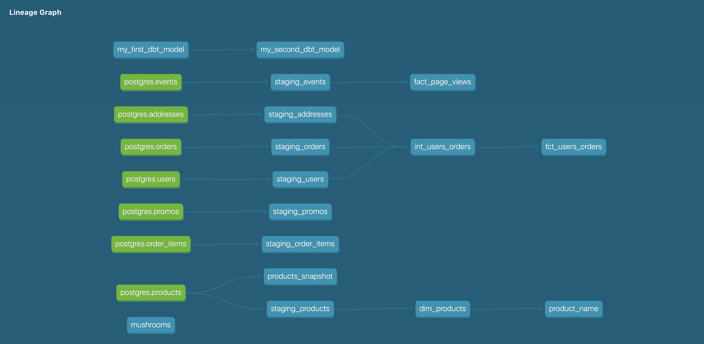

# What is our user repeat rate?

Repeat Rate = Users who purchased 2 or more times / users who purchased

                with more_orders as (
                SELECT COUNT(user_id) as repeated_orders from (
                SELECT user_id, COUNT(order_id) 
                from staging_orders
                GROUP BY user_id
                HAVING COUNT(order_id)>=2)),

                all_orders as (
                SELECT COUNT(DISTINCT user_id) as all_orders
                FROM staging_orders)

                SELECT repeated_orders/(SELECT all_orders from all_orders) as repeated_rate
                from more_orders

0.798387

What are good indicators of a user who will likely purchase again? What about indicators of users who are likely NOT to purchase again? If you had more data, what features would you want to look into to answer this question?

NOTE: This is a hypothetical question vs. something we can analyze in our Greenery data set. Think about what exploratory analysis you would do to approach this question.

- deeper look into user data, e.g. addresses:

                SELECT o.user_id,  u.first_name, u.last_name, u.address_id, a.state, a.country, COUNT(o.order_id)
                FROM staging_orders o
                LEFT JOIN staging_users u
                on o.user_id = u.user_id
                LEFT JOIN staging_addresses a
                on u.address_id = a.address_id
                GROUP BY 1,2,3,4,5,6
                HAVING COUNT(order_id)> 1;

# Lineage Graph

