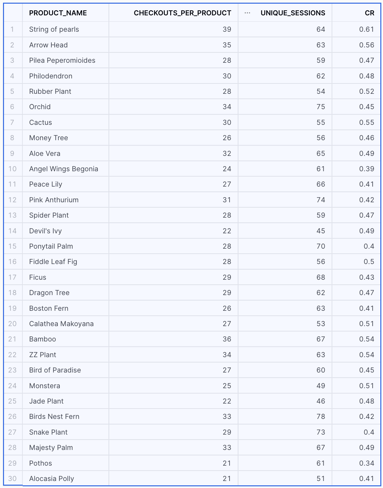
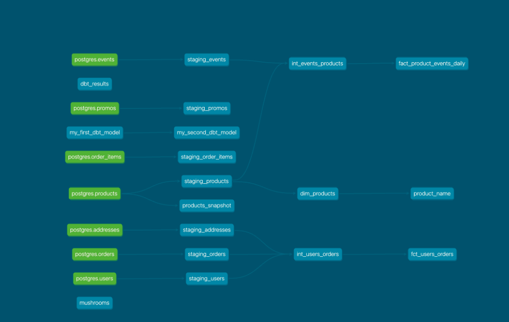

# What is our overall conversion rate?
        SELECT 
                COUNT(DISTINCT session_id) as unique_sessions,
                SUM(checkout) as purchase_sessions,
                ROUND(SUM(checkout)/(COUNT(DISTINCT session_id)),2) as CR
        from int_events_products

0.62

# What is our conversion rate by product?
        WITH sessions_per_product as 
                 ( 
                SELECT 
                product_name,
                COUNT(DISTINCT session_id) as unique_sessions
                from int_events_products
                GROUP BY 1
                ),

        purchased_products as 
                (
                SELECT 
                p.name as product_name,
                COUNT(DISTINCT iep.session_id) as checkouts_per_product
                from int_events_products iep
                LEFT JOIN staging_order_items oi
                ON iep.order_id = oi.order_id
                LEFT JOIN staging_products p
                on oi.product_id = p.product_id
                where event_type = 'checkout'
                GROUP BY 1
                )

        SELECT 
                pp.product_name,
                pp.checkouts_per_product,
                spp.unique_sessions,
                ROUND(pp.checkouts_per_product/spp.unique_sessions,2) as CR
        from purchased_products pp
                LEFT JOIN sessions_per_product spp
                on pp.product_name = spp.product_name;
    

# Macros and packages
- created macro for translating event_types into dummy coded table
- created macro for granting access after models have run
- used generate_surrogate_key from dbt.utils package
- created macros for creating table containing dbt artifacts using [this article](https://medium.com/@oravidov/dbt-observability-101-how-to-monitor-dbt-run-and-test-results-f7e5f270d6b6) as source

# Lineage graph Week3

# Snapshot model
Bamboo: 44
Pothos: 0
String of pearls:0
ZZ Plant: 53
Philodendron: 15
Monstera: 50