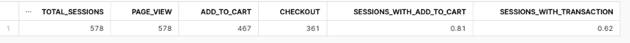

# Snapshot model

| Plant| Week 1 | Week 2 | Week 3 |
|----------|----------|----------|----------|
| Bamboo    | 56   | 44   | 23  |
| Pothos    | 20   | 0   | 20  |
| Philodendron    | 25   | 15   | 30  |
| String of pearls    | 10   | 0  | 10  |
| ZZ Plant   | 89   | 53   | 41  |
| Monstera    | 64  | 50   | 31  |

# Modeling Challenge
How are our users moving through the product funnel?

Which steps in the funnel have largest drop off points?

Product funnel is defined with 3 levels for our dataset:

- Sessions with any event of type page_view

- Sessions with any event of type add_to_cart

- Sessions with any event of type checkout

### Mart Model
- I created one model, "fct_product_funnel_by_product.sql", which contains number of page views, added to cart and checkouts by product and the Conversion Rates 

- I created a second model,  with the overall product funnel, not broken down by product

# Reflection 
Reflecting on your learning in this class...

if your organization is thinking about using dbt, how would you pitch the value of dbt/analytics engineering to a decision maker at your organization?

if your organization is using dbt, what are 1-2 things you might do differently / recommend to your organization based on learning from this course?

if you are thinking about moving to analytics engineering, what skills have you picked that give you the most confidence in pursuing this next step?